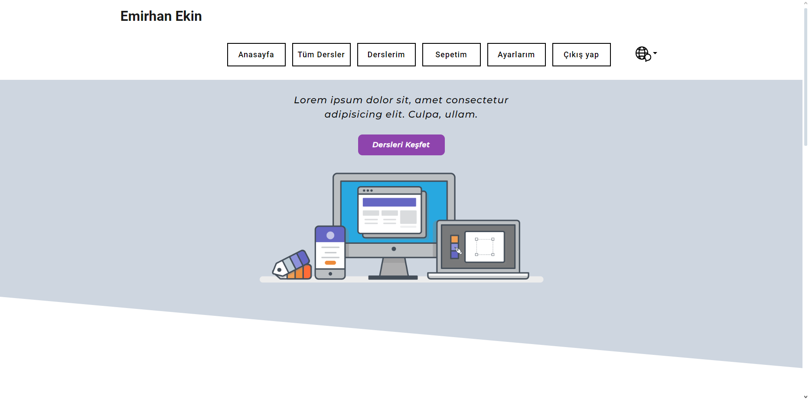
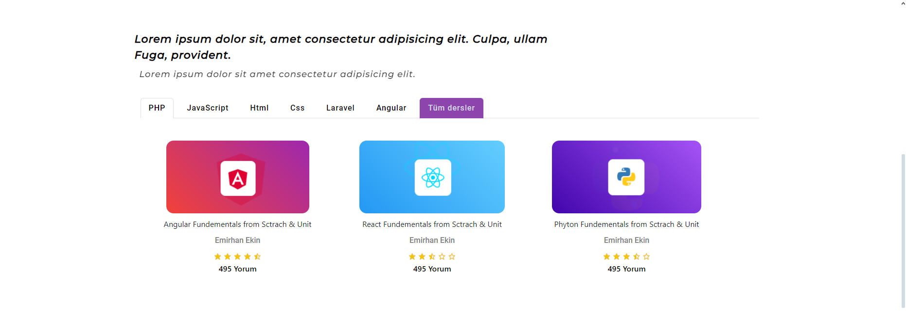
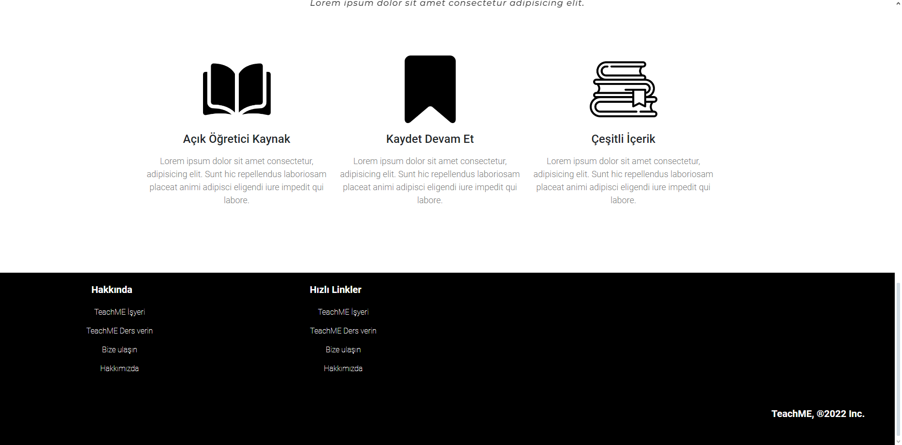
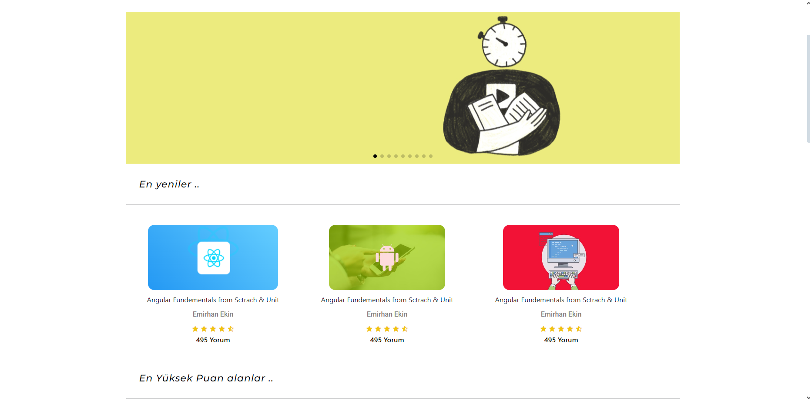
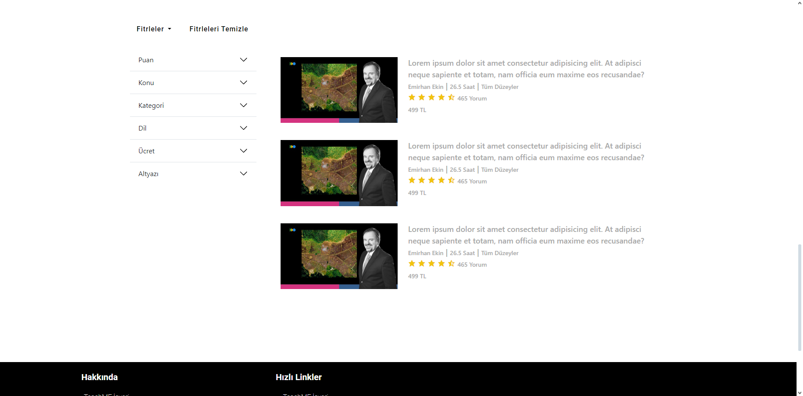

# Education
Education Website with Bootstrap - HTML- CSS - PHP  - Responsive Design   
I only shared the design in this repo. There is a version connected to the php panel.   
Login, Registration, Viewing lessons available.  
Things like adding courses, adding lecturers can be added.   

   

  

   

   

  
